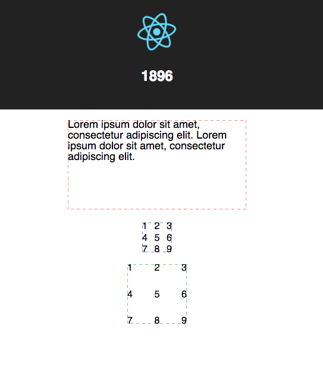

## vx-text-playground 🚀



### Using the following component:

```
<TextBox width={100} height={100}
  valign="middle" align="center">
  5
</TextBox>
```


### `<TextBox>`:

```
import React, { Component } from 'react';

import { Text } from '@vx/text';

class App extends Component {
  render() {
    const { width = 0, height = 0 } = this.props;
    let dx, dy, tA, vA;

    switch (this.props.align) {
        default: // "left"
            dx = 0;
            tA = "start";
            break;
        case "center":
            dx = width / 2;
            tA = "middle";
            break;
        case "right":
            dx = width;
            tA = "end";
            break;
    }

    switch (this.props.valign) {
        default: // "top"
            dy = 0;
            vA = "start";
            break;
        case "middle":
            dy = height / 2;
            vA = "middle";
            break;
        case "bottom":
            dy = height;
            vA = "end";
            break;
    }

    return (
        <Text
            dx={dx}
            dy={dy}
            textAnchor={tA}
            verticalAnchor={vA}
            width={width}>
            {this.props.children}
        </Text>
    );
  }
}

export default App;

```